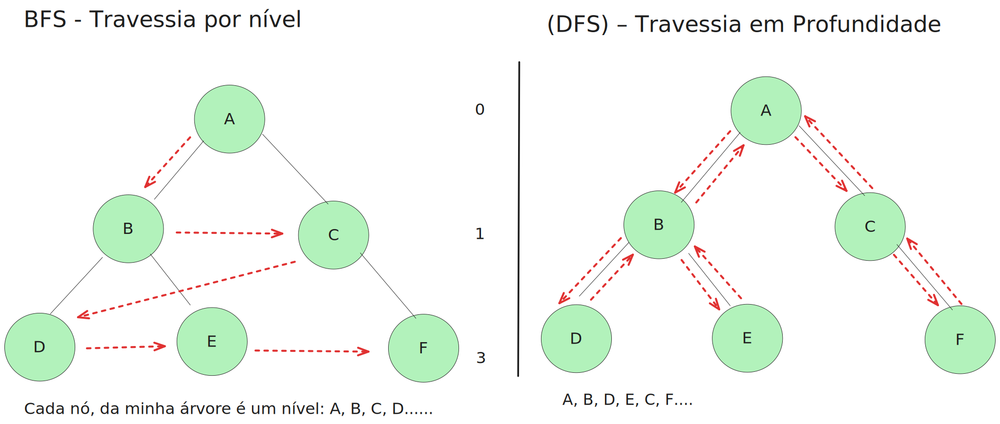
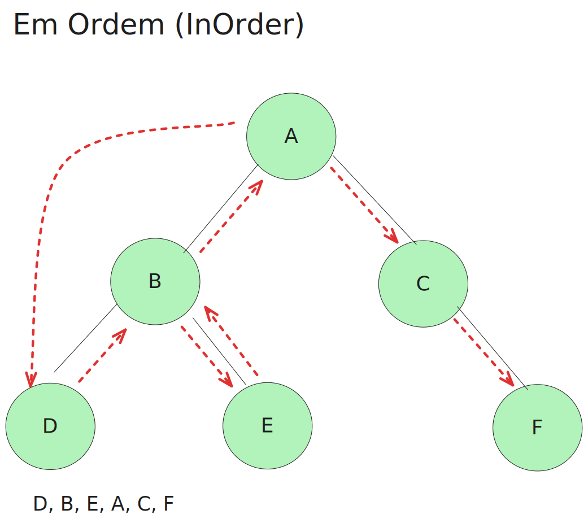
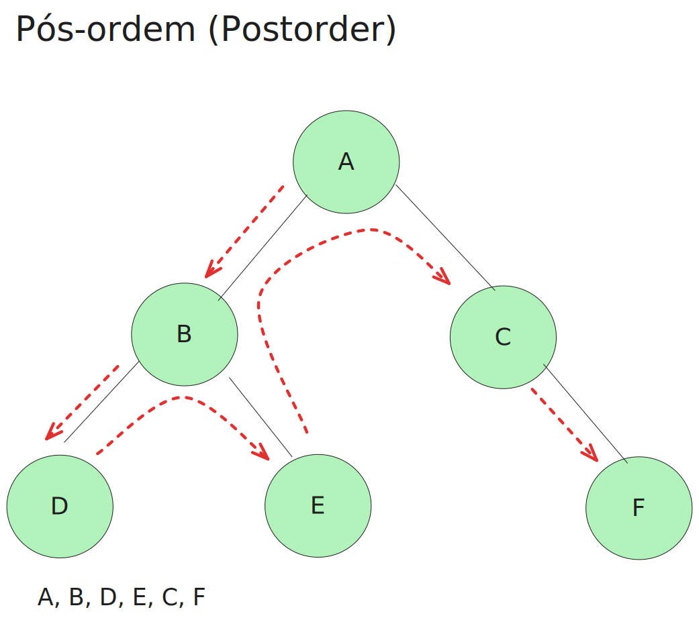
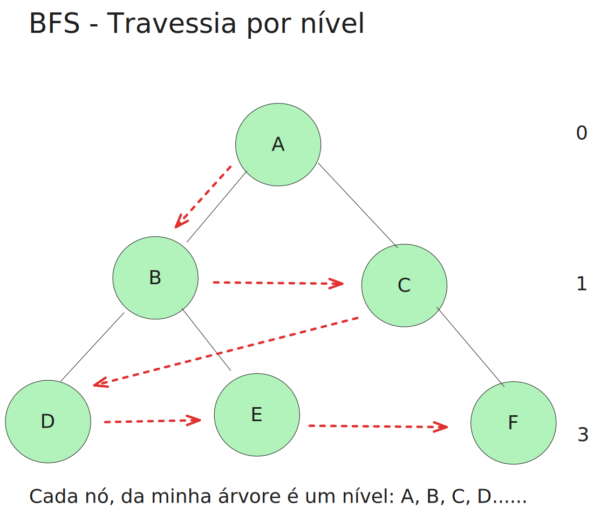

# Travessia

Travessia em árvores tratam de várias maneiras de visitar todos os nós da árvore. Diferentemente das estruturas de dados lineares, que possuem apenas uma maneira lógica de percorrer. Sendo uma operação fundamental de ordenação e manipulação de dados em árvores binárias.

Implementações:

- Algoritmos de inteligência artificial
- Processamento de linguagem natural 

## Travessia em Árvores Binárias: BFS e DFS

A travessia em árvores binárias pode ser feita por:

- Depth-First Traversal (DFS) – Travessia em Profundidade

A DFS, explora todos os nós na profundidade atual antes de passar para os nós.

- Breadth-First Traversal (BFS) – Travessia por nível

A BFS, explora os nós nível por nível, ou seja, ela percorre todos os nós de um nível antes de avançar para o próximo.





### Vamos criar o nosso Node


```js
export class Node {
	constructor(key, value) {
		this.key = key;
		this.value = value
		this.left = null;
		this.right = null;
	}
}
```

Após, criar o nosso node, vamos realizar os inserts, adicionando a nossa arvoré,  e as sub arvoŕes
```js
const root = new Node("A", 1);

root.left = new Node("B", 5);
root.right = new Node("C", 15);
root.left.left = new Node("D", 3);
root.left.right = new Node("E", 7);
root.right.left = new Node("F", 12);
```

## Travessia

Vamos criar uma classe `TravesalBinary`, que dentro dela vai conter nossos métodos de travessia

```js
export class TravesalBinary{

	// Travessia pre-ordem

	// Travessia em ordem (InOrder)

	// Travessia pós-ordem
} 
```

## Travessia pre-ordem

Na travessia pré-ordem, a ordem é bem definida:

1. Visita a raiz (ROOT) primeiro
2. Em seguida, percorre o nó esquerdo
3. Por último, percorre o nó direito


```js
  // Pré-ordem (pre-order traversal)
	preOrder(raiz) {
		if (raiz == null) {
			return;
		}
		// 1. Visita a raiz (ROOT) primeiro
		console.log(raiz.value);
		// 2. Em seguida, percorre o nó esquerdo
		this.preOrder(raiz.left);
		// 3. Por último, percorre o nó direito
		this.preOrder(raiz.right);
	}
```

## Travessia em ordem (InOrder)

Na travessia em ordem (ou in-order), o percurso segue a ordem:

1. Primeiro, visita o nó esquerdo
2. Em seguida, visita a raiz (ROOT)
3. Por último, visita o nó direito



```js
	// in Ordem
	inOrder(raiz) {
		if (raiz == null) {
			return;
		}
		// 1. Primeiro, visita o nó esquerdo
		this.inOrder(raiz.left);
		// 2. Em seguida, visita a raiz (ROOT)
		console.log(raiz.value);
		// 3. Por último, visita o nó direito
		this.inOrder(raiz.right);
	}

```

## Travessia pós-ordem

Na travessia pós-ordem, a ordem é a seguinte:

1. Primeiro, visita o nó esquerdo
2. Em seguida, visita o nó direito
3. Por último, visita a raiz (ROOT)



```js
  // pos ordem
	postOrder(raiz) {
		if (raiz == null) {
			return;
		}
		// 1. Primeiro, visita o nó esquerdo
		this.postOrder(raiz.left);
		// 2. Em seguida, visita o nó direito
		this.postOrder(raiz.right);
		// 3. Por último, visita a raiz (ROOT)
		console.log(raiz.value);
	}
```

## Depth-First Traversal (DFS) – Travessia em Profundidade

A BFS percorre a árvore nível por nível, explorando todos os nós de um nível antes de passar para o próximo. Para isso, ela usa uma fila.

1. Primerio, vamos adicionar o nosso algorimto de fila (LinkedQueue)
2. Implentar dentro do nosso projeto

```js
//  Breadth-First Traversal (BFS) – Travessia por nível
breadthFirstTraversal(raiz) {
	if (raiz == null) {
		return;
	}
	const queue = new LinkedQueue();
	// Adiciona a raiz na fila
	queue.enqueue(raiz);
	// Enquanto a fila não estiver vazia
	while (!queue.isEmpty()) {
		const node = queue.dequeue();
		console.log(node.key);
		
		
		if (node.left !== null) {
			queue.enqueue(node.left);
		}

		if (node.right !== null) {
			queue.enqueue(node.right);
		}
	}
}
```



# Inverter uma árvore binária

Inverter uma árvore binária significa trocar os filhos esquerdo e direito de todos os nós da árvore. Isso resulta em uma estrutura espelhada da árvore original.

### Como inverter uma árvore binária?

A inversão pode ser feita de forma recursiva. O processo envolve trocar os filhos esquerdo e direito de cada nó e, em seguida, aplicar a mesma operação recursivamente nos filhos.

1. Se o nó for null, retorne.
2. Troque os filhos esquerdo e direito do nó atual.
3. Recursivamente, aplique a inversão nos filhos esquerdo e direito.

```js
invertTree(raiz) {
	// Se a raiz for nula, retorna nulo
	if(raiz === null) {
		return null;
	}

	// Inverte o nó esquerdo
	const left = this.invertTree(raiz.left);
	// Inverte o nó direito
	const right = this.invertTree(raiz.right);
	
	// Troca os nós
	raiz.left = right;
	raiz.right = left;
	
	return raiz
}
```


Discentes: 
@igorBrenno
@KayoRonald