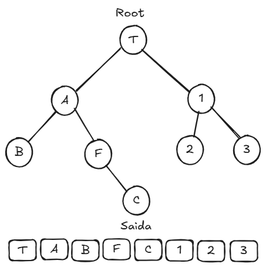
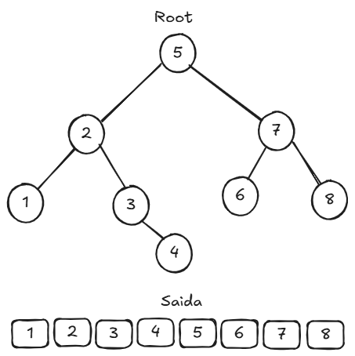

# Travessia

Técnicas de travessia ou percurso de árvores tratam de várias maneiras de visitar todos os nós da árvore. Diferentemente das estruturas de dados lineares, que possuem apenas uma maneira lógica de percorrer.

# Travessia pre-ordem

A travessia pre-ordem segue uma ordem especifica, começando pela raid, esquerda e direita

# Travessia ordem

Travessia em ordem começa pela esquerda, raid e direita

Normalmente mais utilizada em árvores BST, essa travessia visita os nós em uma ordem que os nós são apresentados em ordem crescente.

# Travessia pós-ordem

A travessia pós-ordem, também conhecida como pós-ordem recursiva, visita primeiro o filho à esquerda, em seguida o filho à direita e, por último, o nó raiz. Essa ordem é representada pela seguinte fórmula: esquerda, direita, raiz.